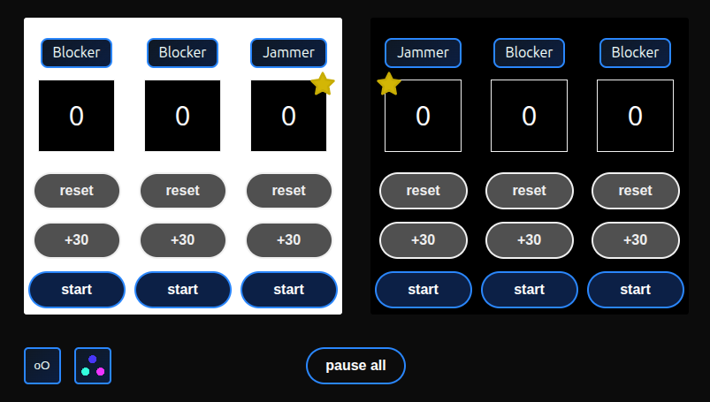
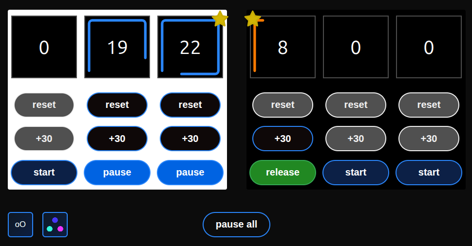

# Pocket Penalty Box Manager

visit : [https://keyobs.github.io/pocket-pbt/](https://keyobs.github.io/pocket-pbt/)

Backup timers for roller derby penalty box when you forget to buy batteries.

The Pocket Penalty Box Manager is a web app designed to serve as a reliable backup for the official penalty box timers in roller derby.

<br>

<p align="center">

</p>

<br>

## ✨ Features

The app is mobile-friendly.

Available :

- 6 countdown timers for each six penalty box seats
- Colored stroke helper
- Customize your own color set

Flexible Timing Configurations:

- Track time for 1 or 2 teams
- Track only jammers
- Track only blockers

Automated Jammer Management :

- Automatically swaps a jammer’s active timer when a new jammer is sent to the box.

<br>

<p align="center">

</p>

<br>
<br>

## NEW TO ROLLER DERBY ?

The sport = [WFTDA - The Game ](https://wftda.com/the-game/)  
The rules = [WFTDA - The Rules of Flat Track Roller Derby](https://rules.wftda.com/)

<br>
<br>

## 💻 Stack

Project is open-source.
Feel free to fork and/or contribute.

Built with React, Vite, and organized as a Turborepo monorepo.
Enforce pnpm use.

**Frontend**

- React **19** + TypeScript
- Turborepo (monorepo task orchestration)
- Less (styling preprocessor)
- Vite (building tool)
- pnpm (package manager)

**Code Quality**

- Biome (linter + formatter)
- Vitest (unit and component testing)
- Husky (commit guard)

**Monitoring**

- Sentry (crash and errors monitoring)
  - optionnal - disabled if no DSN
  - uses secure tunnel on Netlify (prevents ad blockers, keep sentry dsn secret)

**CI/CD & Tooling**

- GitHub Actions (build, test, deploy pipeline)
- GitHub Pages (production deployment)
- Netlify (staging / preview deployment)
- Turbo cache (improves CI build speed)

**Hosting**

Project lives at :

- Github Pages : [https://keyobs.github.io/pocket-pbt/](https://keyobs.github.io/pocket-pbt/)
- Netlify : [https://pocket-pbt.netlify.app/](https://pocket-pbt.netlify.app/)

<br>
<br>

## 🧱 Repository Structure

```
pocket-pbt/
├── github/
│   └── workflows/
├── apps/
│   └── mobile/             # React Native app
│       ├── app
│       ├── package.json
│   └── web/                # React app
│       ├── package.json
│       ├── src/
├── packages/               # Shared logic
│   └── config/
│   └── core/
│       ├── api/
│       ├── constants/
│       └── hooks/
│       └── utils/
├── scripts/
├── turbo.json              # Turborepo pipeline config
├── package.json            # Root workspace config
└── pnpm-workspace.yaml
└── netlify.toml
```

<br>
<br>

## 💻 Developper Setup

### Prerequisites

- Node.js ≥ 22
- (optional) Turbo CLI for better local DX

### ⚙️ Installation

Clone the repository:

```
git clone https://github.com/keyobs/pocket-pbt.git

cd pocket-pbt
```

Install dependencies:

```
pnpm install
```

<br>

### 🧑‍💻 Development

Start the development server for the web app:

```
pnpm dev
```

This runs Turbo in dev mode and starts apps/web via Vite.  
App available at http://localhost:5173/ (auto hot reload enabled).

<br>
<br>

## 🚀 Build & Deployment Simulation

The repository includes Turborepo-powered scripts to simulate real deployments locally.

🧩 Available commands

| Command                 | Description                                                        | URL opened                                       |
| ----------------------- | ------------------------------------------------------------------ | ------------------------------------------------ |
| `pnpm simulate:netlify` | Builds and serves the Netlify version (`base="/"`)                 | [http://localhost:4173/](http://localhost:4173/) |
| `pnpm simulate:github`  | Builds and serves the GitHub Pages version (`base="/pocket-pbt/"`) | [http://localhost:4174/](http://localhost:4174/) |

Both use vite preview via Turborepo.  
They mimic CI/CD behavior — same build command, same environment.

<br>

🧩 Example usage

```
pnpm simulate:netlify   # → preview how the site looks on Netlify
pnpm simulate:github    # → preview how GitHub Pages renders the build
```

You can run both at once — each uses its own port.
Browser opens automatically when ready.

<br>
<br>

🧪 CI/CD Overview

The CI pipeline (.github/workflows/deploy.yml) handles:

| Trigger            | Action                                       | Environment                 |
| ------------------ | -------------------------------------------- | --------------------------- |
| `main` branch      | Test → Build → Deploy                        | `github-pages` (production) |
| `develop` branch   | Test → Build → Deploy                        | `preview-develop`           |
| `test-deploy` tag  | Test → Build → **Simulate only (no deploy)** | —                           |
| `test-preview` tag | Test → Build → Deploy                        | `preview-<tag>`             |

Trigger a test run manually :

```
git tag test-deploy
git push origin test-deploy
```

or deploy a temporary live preview :

```
git tag test-preview
git push origin test-preview
```

<br>

🧩 Notes for Contributors

- Always use pnpm (only-allow enforces it).
- Avoid direct changes in dist/ or generated folders.
- For local testing of builds, use the simulation commands above.
- CI/CD automatically runs tests before deploying.

<br>                    
<br>

## 🧠 TL;DR

| Task                    | Command                     |
| ----------------------- | --------------------------- |
| Install deps            | `pnpm install`              |
| Run dev mode            | `pnpm dev`                  |
| Simulate Netlify deploy | `pnpm simulate:netlify`     |
| Simulate GitHub deploy  | `pnpm simulate:github`      |
| Run tests               | `pnpm test`                 |
| Format/lint             | `pnpm format` / `pnpm lint` |

<br>
<br>
<br>
<br>

📜 License  
MIT License [©keyobs](https://github.com/keyobs)

<br>

🤝 Contributing  
We welcome contributions from the community !  
If you're interested in helping, please check out our CONTRIBUTING.md file for guidelines on setting up your environment, submitting pull requests, and coding standards.
